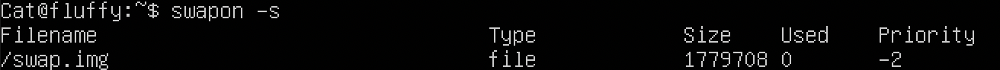

<!-- # UNIX/Linux operating systems (Basic). -->
# Операционные системы UNIX/Linux (Базовый).

## Part 1. Установка ОС
Выводим версию Ubuntu

## Part 2. Создание пользователя
- Создаем пользователя

    
- Выводим список пользователей

    

- Добавлем пользователя в группу

    

## Part 3. Настройка сети ОС
1. **Смена названия машины на user-1**
    - С помощью vim меняем содержимое файла /etc/hostname

        
    - Выводим hostname

        
    - Выводим hostname после перезагрузки

        
    
2. **Установка временной зоны, соответствующей вашему текущему местоположению.**
    - Текущая временная зона

        
    - С помощью команды `timedatectl list-timezones` смотрим список всех доступных часовых поясов и находим нужный(*Europe/Moscow*)
    - Меняем временную зону

        
    - Проверяем

        

3. **Вывод названия сетевых интерфейсов с помощью консольной команды.**
    <!-- Сетевые интерфейсы предназначены для передачи данных между программами через компьютерную сеть. \
    В Linux любые данные, которые компьютер отправляет в сеть или получает из сети, проходят через сетевой интерфейс. \
    Сетевые интерфейсы могут быть как физическими, так и виртуальными. -->

    - С помощью команды `ip a` (или `ip address show`) выыедем названия сетевых интерфейсов

        

    - Или в укороченном виде

        

        <!-- Сетевой интерфейс — физическое или виртуальное устройство, предназначенное для передачи данных между программами через компьютерную сеть. -->

    - lo (loopback device) – виртуальный интерфейс, присутствующий по умолчанию в любом Linux. Он используется для отладки сетевых программ и запуска серверных приложений на локальной машине. 

        Кроме проверки работоспособности сети, данный интерфейс обеспечивает и другой ряд функций, к примеру, обмен электронными сообщениями, push-уведомления, авторизация при помощи аккаунтов социальных сетей и других сайтов.

        С этим интерфейсом всегда связан адрес 127.0.0.1. У него есть dns-имя – localhost. Посмотреть привязку можно в файле */etc/hosts*.

    <!-- Loopback интерфейс — разработка, внедряемая в многие современные программы и приложения. В частности, он нужен для корректной работы маршрутизатора и интернет сети. -->
4. **Вывод ip адрес устройства от DHCP сервера  помощью консольной команды.**
    <!-- Для работы по сети любому устройству требуется IP-адрес. В протоколе IPv4 это числовой идентификатор, состоящий из 4 разрядов, каждый из которых отделяется точкой, без него устройство не может быть определено в сетевой инфраструктуре.
    Прикладной протокол DHCP выполняет всю работу по подбору сетевых настроек автоматически, без необходимости присваивать вручную каждому устройству свой IP-адрес. Это очень упрощает работу системного администратора в случае расширения сети. -->
    - DHCP (англ. Dynamic Host Configuration Protocol — протокол динамической настройки узла) — прикладной протокол, позволяющий сетевым устройствам автоматически получать IP-адрес и другие параметры, необходимые для работы в сети TCP/IP.

    - Для просмотра всех записей в таблице маршрутизации используем команду `ip route` (или `ip r`):

        

5. **Вывод на экран внешнего ip-адреса шлюза (ip) и внутреннего IP-адреса шлюза (он же ip-адрес по умолчанию (gw)).**

    <!-- Внутренний (локальный) IP — это IP-адрес, который выдается компьютеру в пределах внутренней локальной сети. Такой адрес не используется для выхода в сеть. \
    \
    Внешний IP-адрес вы получаете от вашего провайдера. Он может быть статическим и динамическим (меняется каждый раз когда вы подключаетесь к сети). -->
    - Для определения внешного IP-адреса мы можем открыть специальный сайт, который посмотрит, с какого IP мы его открыли, и скажет его нам. Есть несколько таких сайтов (Например, eth0.me). Сделать это можно из терминала с помощью команды `wget`. \
        
        
    - Внутренний IP-адрес можно найти с помощью команды `ip a` \
        
        Здесь 10.0.2.15 — IP-адрес, а 24 – маска подсети.

        Так же внутренний IP-адрес можно определить с помощью команды `hostname –I`. \
        
    
6. **Статичные (заданные вручную, а не полученные от DHCP сервера) настройки ip, gw, dns (использовать публичный DNS серверы, например 1.1.1.1 или 8.8.8.8).**
    - Для начала необходимо изменить файл конфигурации Netplan в директории */etc/netplan* (00-installer-config.yaml).
    Его изначальный вид \
    
    После изменений \
    

    - Чтобы применить изменения, выполняем команду `sudo netplan apply`.

7. **Перезагрузка виртуальной машины. Убедиться, что статичные сетевые настройки (ip, gw, dns) соответствуют заданным в предыдущем пункте.**
    - Перезагружаем машину с помощью команды `reboot` и смотрим сетевые настройки \
    
    
    

    - Выполняем пинг удаленных хостов 1.1.1.1 и ya.ru \
    
    

## Part 4. Обновление ОС
- Для получения списка новых пактов, которые можно установить, выполняем команду `sudo apt-get update`:\

- Затем, для непосредственно выполнения обновления пакетов, используем команду `sudo apt-get upgrade`. \
Проверяем список обновлений повторным вызовом этой команды и видим, что обновления отсутствуют \

## Part 5. Использование команды **sudo**
- Команда `sudo` ( substitute user and do, подменить пользователя и выполнить ) позволяет строго определенным пользователям выполнять указанные программы с административными привилегиями без ввода пароля суперпользователя root. Таким образом, использование sudo позволяет выполнять привилегированные команды обычным пользователям без необходимости ввода пароля суперпользователя root . Список пользователей и перечень их прав по отношению к ресурсам системы может быть настроен оптимальным образом для обеспечения комфортной и безопасной работы. 

- Для того, чтобы разрешить пользователю, созданному в Part 2, выполнять команду *sudo*, добавим его в группу *sudo* и переключим пользователя на Cat \

 
\
Как и в Part 3, в файле /etc/hostname меняем hostname на *flaffy*, перезагружаем машину и проверяем hostname \

## Part 6. Установка и настройка службы времени
- Выполняем загрузку и установку пакетов ntp(протокол синхронизации времени по сети) с помощью команд `sudo apt-get install ntp` и `sudo apt install systemd-timesyncd`. \
С помощью команды `timedatectl show` выведем время, соответствующее нашему часовому поясу \

## Part 7. Установка и использование текстовых редакторов
1. **Установка текстовых редакторов** \
    Текстовый редактор *vim* уже установлен. С помощью команд `sudo apt-get install nano/mcedit` установим редакторы *nano* и *mcedit*.

2. **Создание текстовых файлов**
    - Используя команду `vim test_vim.txt` создаем и открываем текстовый файл. В нём пишем никнейм и выходим с сохранением, нажимая `esc`(выход из режима редактирования файла) и набираем команду `:wq`. \
    

    - Используя команду `nano test_nano.txt` создаем и открываем текстовый файл. В нём пишем никнейм. \
    Чтобы выйти с сохранением нажимаем `Ctrl+X`, на вопрос "Save modified buffer?" выбираем "y", подтверждаем название файла, нажимая `esc`. \
    

    - Используя команду `mcedit test_mcedit.txt` создаем и открываем текстовый файл, записываем в нём никнейм. \
    Чтобы сохранить файл, используем сочетание клавиш `fn+F2` и подтверждаем. Для выхода `fn+F10`. \
    

3. **Отредактируем файлы, заменив никнейм на "21 School 21"**
    - Для редактирования файла в *vim* нажимаем `i`. Для выхода без сохранения нажимаем  `esc` и `:q!`. \
    
    - Для выхода без сохранения в *nano* нажимаем `Ctrl+X`, на вопрос "Save modified buffer?" выбираем "n". \
    
    - Чтобы выйти без сохранения из *mcedit*, нажимаем `fn+F10` и выбираем "no". \
    

4. **Поиск по содержимому файла и замена слов**
    - Для поиска в *vim* нажимаем `/` и вводим слово. Чтобы перейти к следущему найденному слову, нажимаем `n`.\
     \
    Для замены "21" на "42" используем команду `:s/21/42/g`, */g* нужен для замены всех найденных слов. \
    

    - Для поиска в *nano* нажимаем `Ctrl+W`, вводим слово. Курсор перемещается на найденное слово. \
     \
    Для замены нажимаем `option+R`, вводим слово, которое будем менять, и слово, на которое будем менять. Подтверждем замену, нажимая "y". \
     \
     \
     

    - Для поиска в *mcedit* нажимаем `fn+F7`, вводим слово и параметры. \
     \
     \
    Для замены нажимаем `fn+F4`, вводим слово и параметры. \
     \
     \
    

## Part 8. Установка и базовая настройка сервиса **SSHD**
1. Служба **SSH** позволяет получить доступ к терминалу удаленного компьютера и выполнить там все необходимые вам команды. Включить доступ по SSH можно, если установить OpenSSH. \
    Для установки SSH выполним команду `sudo apt-get install ssh`. \
    Командой `sudo apt install openssh-server` устанавливаем OpenSSH.
    Проверяем статус SSH \
    

2. Добавим **автостарт службы** при загрузке системы с помощью `sudo systemctl enable sshd`. \

3. **Перенастройка службы SSHd на порт 2022.** \
    Для изменения порта редактироем файл */etc/ssh/sshd_config* командой `sudo vim /etc/ssh/sshd_config`\
    

4. **Используя команду ps, показать наличие процесса sshd. Для этого к команде нужно подобрать ключи.** \
С помощью команды `ps -ef | grep sshd` Проверяем наличие процесса sshd. Флаг *e* выводит все процессы, *f* выводит максимум доступных данных. \
 \
Для команды *ps* есть и другие флаги. Например, *u* - выбрать процессы пользователя; *a* - выбрать все процессы, кроме фоновых; *G* - выбрать процессы по ID группы; *t* - выбрать процессы по tty; *N* - выбрать все процессы кроме указанных; *f* - вывести максимум доступных данных, например, количество потоков; *p* - выбрать процессы PID; *l* - длинный формат вывода; *V* - вывести информацию о версии; *o* - позволяет определить свой формат вывода; \
Делаем перезагрузку системы - `reboot`.

5. - Команда **netstat** отображает таблицы маршрутизации, фактические сетевые подключения и информацию о состоянии каждого устройства сетевого интерфейса. Флаг **t** - отображение cостояния соединения по протоколу передачи, **a** - показать все соединения, **n** -  использовать IP-адрес напрямую, а не через сервер доменных имен.
    - Командой `sudo apt install net-tools` устанавливаем пакеты. \
Выполняем `netstat -tan` \

**Proto** - название протокола (протокол TCP или протокол UDP). \
**recv-Q** - очередь получения сети. Указывает, что полученные данные были получены и помещены в буфер локально, но сколько еще не было удалено процессом. Если очередь приема Recv-Q была заблокирована в recv (), это может быть атака типа отказ в обслуживании. \
**send-Q** - сетевая очередь отправки. Данные, которые другая сторона не получила, или нет подтверждения, или локального буфера. \
**Local Address** - окальный адрес (имя локального хоста) и номер порта сокета. \
**Foreign Address** - удаленный адрес (имя удаленного хоста) и номер порта сокета. \
**State** - состояние сокета. \
Обозначение **0.0.0.0** может иметь разное значение в зависимости от того, где используется. Когда говорят о прослушиваемых портах, это обозначение в Linux символизирует заполнитель, то есть означает «любой IP адрес».

## Part 9. Установка и использование утилит **top**, **htop**
1. Команда `top`: \

    - uptime(последняя перезагрузка): 14 min
    - количество авторизованных пользователей: 1
    - общая загрузка системы(load averages):
        - 0.0 - за 1 минуту до ввода команды top
        - 0.0 - за 5 минут
        - 0.0 - за 15 минут
    - общее количество процессов: 96
    - загрузка cpu:
        - 0.0 us - 0.0% процессорного времени занимает пользовательский процесс
        - 0.0 sy - 0.0% процессорного времени занимает системный процесс
        - 0.0 ni - 0.0% процессорного времени занимает выполнение процессов с заданных приоритетом
        - 100.0 id - 100.0% процессорного времени не используется
        - 0.0 wa - 0.0% процессорного времени на выполнение операций IO (ввода/вывода), то есть дисковых операций. Чем медленнее диск, тем выше будет значение для каждого процесса
        - 0.0 hi - 0.0% времени на обработку аппаратных прерываний (на уровне железа)
        - 0.0 si - 0.0% времени на обработку программных прерываний (на уровне программном)
        <!-- Прерывания - это сигналы для процессора о событии, которое требует немедленного внимания. Аппаратные прерывания обычно используются периферийными устройствами, чтобы сообщить системе о событиях, таких как нажатие клавиш на клавиатуре. С другой стороны, программные прерывания генерируются из-за определенных инструкций, выполняемых на процессоре. -->
        - 0.0 st - 0.0% мера загруженности гипервизора
        <!-- ( программа или аппаратная схема, обеспечивающая одновременное, параллельное выполнение нескольких операционных систем на одном и том же хост-компьютере) -->
    - загрузка памяти: используется 148.1 из 1983.4
    - pid процесса занимающего больше всего памяти: 653\
    
    - pid процесса, занимающего больше всего процессорного времени: 1149 \
    

2. Команда `htop`:
    - Установливаем с помощью команды `sudo apt-get install htop`
    - Для сортировки используем `fn+F6` и выбираем необходимый параметр. \
    Сортировка по:
        - PID \
        
        - PERCENT_CPU \
        
        - PERCENT_MEM \
        
        - TIME \
        
    - Для фильтрации для процесса *sshd* нажимаем `fn+F4` и вводим "sshd" \
        
    - Для поиска *syslog* нажимаем `fn+F3` и вводим "syslog" \
        
    - Для для добавления полей нажимаем `fn+F2` и выбираем *hostname*, *clock* и *uptime* \
        

## Part 10. Использование утилиты **fdisk**
Для получении информации о жёстком диске используем `fdisk -l` \

Для просмотра *swap* используем `swapon -s` \

- Название жёсткого диска: /dev/sda
- Размер: 10 Гб
- Количество секторов: 20971520
- Размер swap: 1 779 708 б (1.7 Гб)

## Part 11. Использование утилиты **df**
1. Команда `df`: <!--  --> \

    - Размер раздела: 9299276 Кб
    - Размер занятого пространства: 4636436 Кб
    - Размер свободного пространства: 4168864 Кб
    - Процент использования: 53%

2. Команда `df -Th`: <!--  --> \

    - Размер раздела: 8.9 Гб
    - Размер занятого пространства: 4.5 Гб
    - Размер свободного пространства: 4.0 Гб
    - Процент использования: 53%
    - Тип файловой системы: ext4.

## Part 12. Использование утилиты **du**
1. Команда `du` \
    
2. Вывод папок:
    - /home \
        
    - /var \
        
    - /var/log \
        
3. Вывести размер всего содержимого в /var/log \
    

## Part 13. Установка и использование утилиты **ncdu**
1. Установливаем утилиту *ncdu* командой `sudo apt-get install ncdu` \
    
2. Выводим размер папок:
    - /home \
        
    - /var \
        
    - /var/log \
        

## Part 14. Работа с системными журналами
1. **Откроем системные журналы** /var/log/dmesg, /var/log/syslog, /var/log/auth.log
    - `sudo less /var/log/dmesg` <!-- содержит системные сообщения времени загрузки ядра, а также все другие сообщения ядра, связанные с устройствами и загрузкой модуля --> \
    
    - `sudo less /var/log/syslog` <!-- является основным системным журналом и в нем сохраняются сообщения демонов и других программ, работающих в системе, например, dhclient, cron, init, xscreensaver, а также некоторые сообщения ядра --> \
    
    - `sudo less /var/log/auth.log` <!-- содержит информацию об авторизации пользователей в системе, включая пользовательские логины и механизмы аутентификации, которые были использованы --> \
    

2. В файле */var/log/auth.log* найдем
    - время последней успешной авторизации: 13:53:26
    - имя пользователя: Cat
    - метод входа в систему: LOGIN(uid=0)
    

3. С помощью команды `sudo systemctl restart ssh` перезапускаем службу *sshd*. Накодим в файле */var/log/auth.log* сообщение о рестарте \
    

## Part 15. Использование планировщика заданий **CRON**
1. - Исполльзуя команду `crontab -e`, изменим расписание задач, которые cron будет запускать. \
 \
Добавим задачу \

    - Для проверки выполнения команды *uptime* найдем нужные записи в файле */var/log/syslog*, используя команду `sudo grep uptime /var/log/syslog` \
    
    - Выведем на экран список текущих заданий для CRON с помощью `crontab -l` \
    

2. Удаляем все задания из планировщика заданий командой `crontab -r` и смотри список текущих заданий для CRON \

